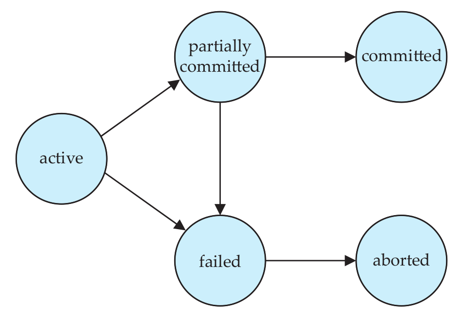
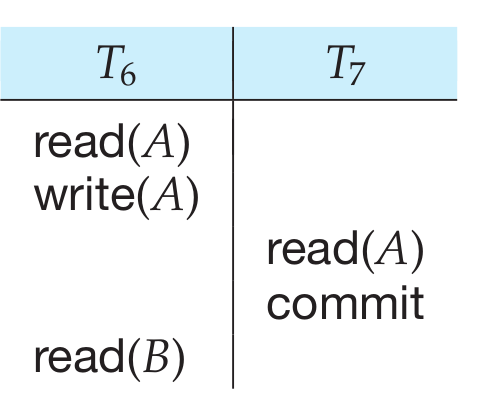
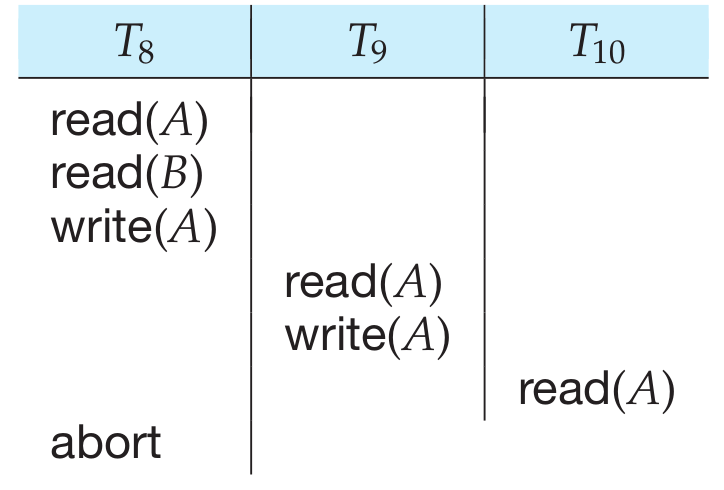

# Transactions

## What is a transaction?

A transaction is a unit of program execution that accesses and possibly updates various data items.
A transaction is delimited by statements (or function calls) of the form **begin transaction** and **end transaction**. The transaction consists of all operations executed between the begin transaction and end transaction.

Not that once a transaction has committed, we cannot undo its effects by aborting it. The only way to undo the effects of a committed transaction is to execute a compensating transaction.

## Properties of transactions (ACID)

### Atomicity

This collection of steps must appear to the user as a single, indivisible unit. Since a transaction is indivisible, it either executes in its entirety or not at all. Thus, if a transaction begins to execute but fails for whatever reason, any changes to the database that the transaction may have made must be undone.

### Consistency

A transaction must preserve database consistency - if a transaction is run atomically in isolation starting from a consistent database, the database must again be consistent at the end of the transaction. This consistency requirement goes beyond the data integrity constraints we have seen earlier (such as primary-key constraints, referential integrity, check constraints, and the like). How this is done is the responsibility of the programmer who codes a transaction. 

### Isolation

As every transaction is a single unit, its actions cannot appear to be separate by other database operations not part of the transaction. However, we now that reality is quite different. Even a single SQL statement involves many separate accesses to the database, and a transaction may consist of several SQL statements. Therefore, the database system must take special actions to ensure that transactions operate properly without interference from concurrently executing database statements. This property is referred to as isolation.

### Durability

After a transaction completes successfully, the changes it has made to the database persist, even if there are system failures. 

## Transaction states

- **Active**: The initial state; the transaction stays in this state while it is executing.

- **Partially committed:** After the final statement has been executed.

- **Failed:** After the discovery that normal execution can no longer proceed.

- **Aborted:** After the transaction has been rolled back and the database has been restored to its state prior to the start of the transaction.

- **Committed:** After successful completion.

  

**Example:**

Once the execution of the transaction completes successfully, and the user who initiated the transaction has been notified that the transaction was successful, it must be the case that no system failure can result in a loss of data. 

Two ways to handle this:

- The updates carried out by the transaction have been written to disk before the transaction completes.
- Information about the updates carried out by the transaction and written to disk is sufficient to enable the database to reconstruct the updates when the database system is restarted after the failure.

## Simple Transaction Model

For simplicity we only focus on **insert** and **delete** operations. Furthermore, we consider the following two operations:

- **read(X)**: Transfers the data item $X$ from the database to a variable, also called $X$, in a buffer in main memory belonging to the transaction that executed the read operation.

- **write(X):** Transfers the value in the variable X in the main-memory buffer of the transaction that executed the write to the data item X in the database.

  **Note:** In a real database system, the write operation does not necessarily result in the immediate update of the data on the disk; the write operation may be temporarily stored elsewhere and executed
  on the disk later. For now, however, we shall assume that the write operation updates the database immediately.

## Storage structure

- **Volatile storage:** Information residing in volatile storage does not usually survive system crashes. Examples of such storage are main memory and cache memory. Access to volatile storage is extremely fast, both because of the speed of the memory access itself, and because it is possible to access any
  data item in volatile storage directly.
- **Nonvolatile storage:** Information residing in nonvolatile storage survives system crashes. Examples of nonvolatile storage include secondary storage devices such as magnetic disk and flash storage, used for online storage, and tertiary storage devices such as optical media, and magnetic tapes, used for
  archival storage. At the current state of technology, nonvolatile storage is slower than volatile storage.
- **Stable storage:** Information residing in stable storage is **never** lost. Although stable storage is theoretically impossible to obtain, it can be closely approximated by techniques that make data loss extremely unlikely. To implement stable storage, we replicate the information in several nonvolatile
  storage media.

## Transaction isolation

Transaction-processing systems usually allow multiple transactions to run concurrently. Allowing multiple transactions to update data concurrently causes several complications with consistency of the data, as we saw earlier. Ensuring consistency in spite of concurrent execution of transactions requires extra work; it is far easier to insist that transactions run serially—that is, one at a time, each starting only after the previous one has completed.

## Serializability

Let us consider a schedule $S$ in which there are two consecutive instructions $I$ and $J$ , of transactions $T_i$ and $T_j$ , respectively ($i \geq j$). If $I$ and $J$ refer to different data items, then we can swap $I$ and $J$ without affecting the results of any instruction in the schedule. However, if $I$ and $J$ refer to the same data item $Q$, then the order of the two steps may matter.

- $I=read(Q)$, $J=read(Q)$. The order of $I$ and $J$ does not matter since the value of $Q$ is read by $T_i$ and $T_j$, regardless of the order.
- $I=read(Q)$, $J=write(Q)$. If $I$ comes before $J$, then $T_i$ does not read the value of $Q$ that is written by $T_j$ in instruction $J$. If $J$ comes before $J$ comes before $I$, then $T_i$ reads the value of $Q$ that is written by $T_j$. Thus, the order of $I$ and $J$ matters.
- $I = write(Q)$, $J = read(Q)$. The order of $I$ and $J$ matters for reasons similar to those of the previous case.
- $I=write(Q)$, $J=write(Q)$. Since both instructions are *write* operations, the orer of these instructions does not affect either $T_i$ or $T_j$. However, the value obtained by the next $read(Q)$ instruction of $S$ is affected since the result of only the latter of the two *write* instructions is preserved in the database.

Thus, onyl in the case where both $I$ and $J$ are *read* instructions does the relative order of their exection not matter. We say that $I$ and $J$ **conflict** if they are operations by different transactions on the same data item, and at least one of these instructions is a write operation.

If a schedule $S$ can be transformed into a schedule $S'$ by a series of swaps of **non-conflicting** instructions, we say that $S$ and $S'$ are **conflict equivalent**. Not all serial schedules are conflict equivalent to each other. The concept of conflict equivalence leads to the concept of conflict serializability. We say that a schedule $S$ is **conflict serializable** if it is **conflict equivalent to a serial schedule**.

#### Determine Conflict Serializability

Consider a schedule $S$. We construct a directed graph, called a precedence graph, from $S$. This graph consists of a pair $G = (V, E)$, where $V$ is a set of vertices and $E$ is a set of edges. The set of vertices consists of all the transactions participating in the schedule. The set of edges consists of all edges
$T_i \rightarrow  T_j$ for which one of three conditions holds:

- $T_i$ executes $write(Q)$ before $T_j$ executes $read(Q)$
- $T_i$ executes $read(Q)$ before $T_j$ executes $write(Q)$
- $T_i$ executes $write(Q)$ before $T_j$ executes $write(Q)$

If any edge $T_i \rightarrow T_j$ exists in the precedence graph, then, in any serial schedule $S'$ equivalent to $S$, $T_i$ must appear before $T_j$. If the precedence graph for S has a cycle, then schedule S is not conflict serializable. If the graph contains no cycles, then the schedule S is conflict serializable.

## Recoverable Schedules

Consider the partial schedule in which $T_7$ is a transaction that performs only one instruction: $read(A)$. We call this a **partial schedule*** because we have not included a commit or abort operation for $T_6$ . Notice that $T_7$ commits immediately after executing the $read(A)$ instruction. Thus, $T_7$ commits while $T_6$ is still in the active state. Now suppose that $T_6$ fails before it commits. $T_7$ has read the value of data item $A$ written by $T_6$ . Therefore, we say that $T_7$ is dependent on $T_6$ . Because of this, we must abort $T_7$ to ensure atomicity. However, $T_7$ has already committed and cannot be aborted. Thus, we have a situation where it is
impossible to recover correctly from the failure of $T_6$ . This is an example of a **nonrecoverable schedule**. A recoverable schedule is one where, for each pair of transactions $T_i$ and $T_j$ such that $T_j$ reads a data item
previously written by $T_i$ , the commit operation of $T_i$ appears before the commit operation of $T_j$ . For the example to be recoverable, $T_7$ would have to delay committing until after $T_6$ commits.

## Cascadeless Schedules

Even if a schedule is recoverable, to recover correctly from the failure of a transaction $T_i$ , we may have to roll back several transactions. Such situations occur if transactions have read data written by $T_i$ . 

Consider the partial schedule in the example. 

Transaction $T_8$ writes a value of $A$ that is read by transaction $T_9$ . Transaction $T_9$ writes a value of $A$ that is read by transaction $T_{10}$ . Suppose that, at this point, $T_8$ fails. $T_8$ must be rolled back. Since $T_9$ is dependent on $T_8$ , $T_9$ must be rolled back. Since $T_{10}$ is dependent on $T_9$ , $T_{10}$ must be rolled back.

Formally, a cascadeless schedule is one where, for each pair of transactions $T_i$ and $T_j$ such
that $T_j$ reads a data item previously written by $T_i$ , the commit operation of $T_i$ appears before the read operation of $T_j$ .

## Transaction Isolation Levels

The SQL standard also allows a transaction to specify that it may be executed in such a way that it becomes nonserializable with respect to other transactions. For instance, a transaction may operate at the isolation level of **read uncommitted**, which permits the transaction to read a data item even if it was written by a transaction that has not been committed.

- **Serializable:** Isually ensures serializable execution. However, as we shall explain shortly, some database systems implement this isolation level in a manner that may, in certain cases, allow nonserializable executions.
- **Repeatable read:** Allows only committed data to be read and further requires that, between two reads of a data item by a transaction, no other transaction is allowed to update it. However, the transaction may not be serializable with respect to other transactions. For instance, when it is searching for data
  satisfying some conditions, a transaction may find some of the data inserted by a committed transaction, but may not find other data inserted by the same transaction.
- **Read committed:** Allows only committed data to be read, but does not require repeatable reads. For instance, between two reads of a data item by the transaction, another transaction may have updated the data item and committed.
- **Read uncommitted:** Allows uncommitted data to be read. It is the lowest isolation level allowed by SQL 

All the isolation levels above additionally disallow **dirty writes**, that is, they disallow writes to a data item that has already been written by another transaction that has not yet committed or aborted.

